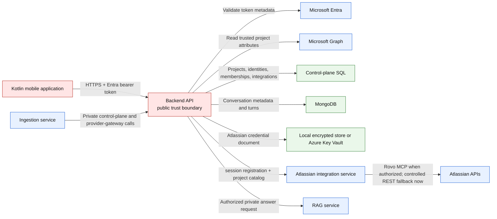
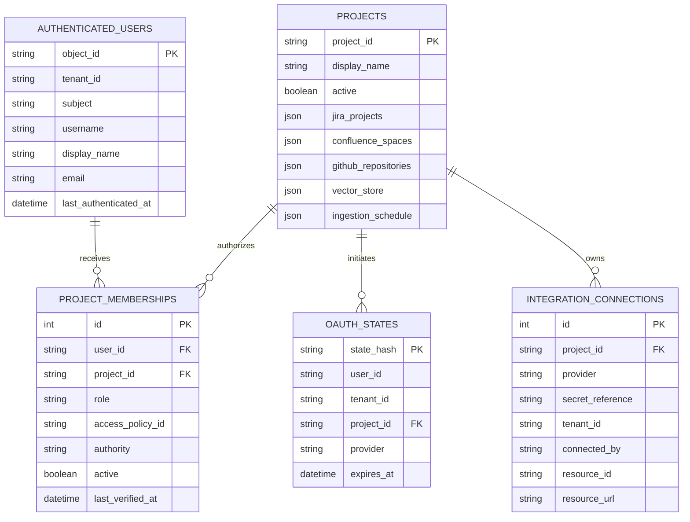
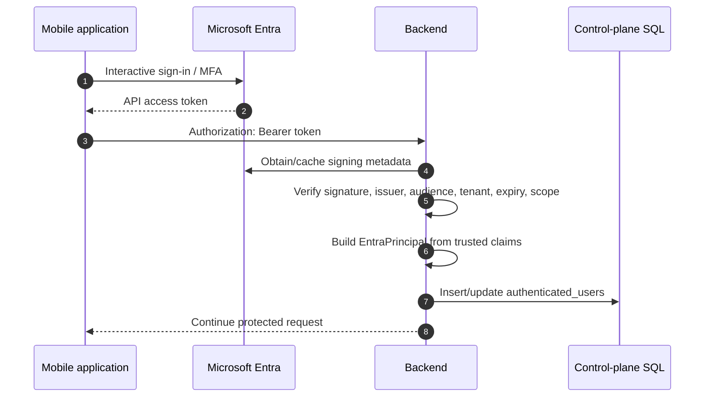
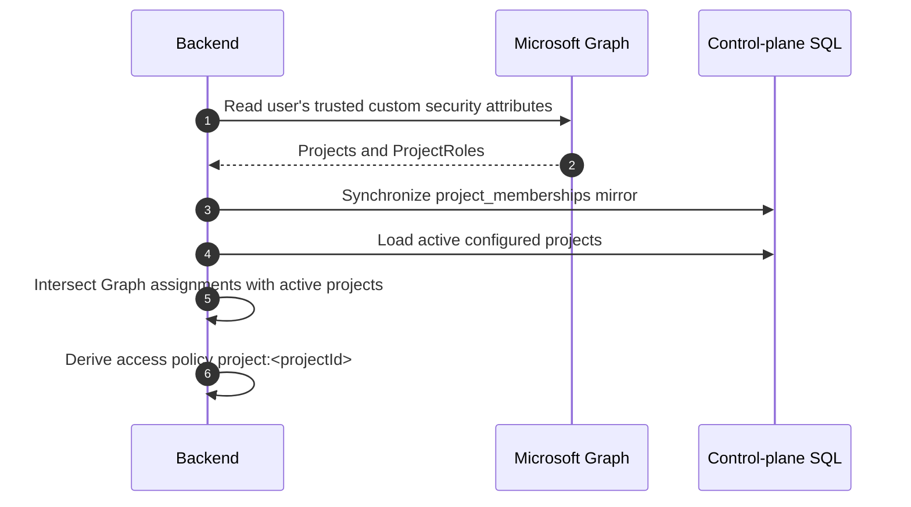
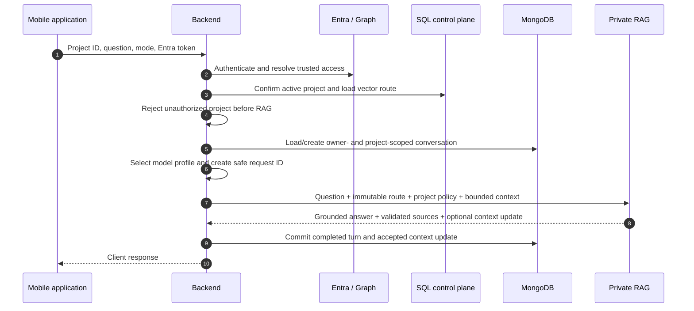
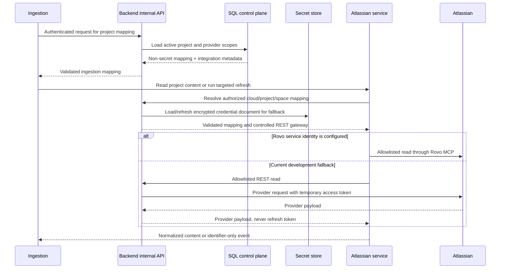
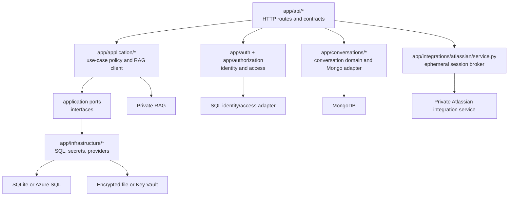
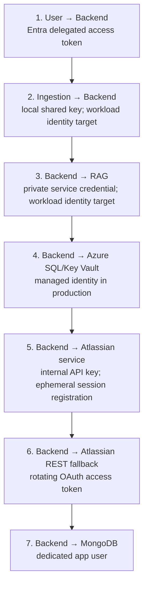

# Project Intelligence Backend — current architecture

Last verified against the repository code and active local configuration: 2026-09-12.

This is the single architecture reference for the backend project. It describes the implemented
public trust boundary, authorization model, current local storage, production storage target,
provider integration gateway, chat memory, and private RAG orchestration.

## 1. Purpose and boundary

The backend is the only public server in Project Intelligence. It sits between the mobile client
and every private service or data store.

It owns:

- Microsoft Entra access-token validation;
- user identity recording and project authorization resolution;
- project, provider, and vector-route configuration;
- Atlassian OAuth connection management and credential brokering;
- conversation ownership and persistence;
- selection of the RAG model profile;
- construction of immutable project/access context for RAG;
- safe translation of dependency failures into client responses.

It does not parse provider documents, create embeddings, write Chroma records, retrieve evidence,
or generate answers itself.

## 2. System context



The frontend connects only to the backend. It never receives SQL, Chroma, MongoDB, provider, or
workload credentials.

## 3. Current local and production data architecture

The application uses one SQLAlchemy control-plane model with two deployment choices.

### Current local development

The active backend configuration points to this SQLite file:

```text
<workspace>/project-intelligence-backend/.local-sql/control-plane.db
```

SQLite is an embedded database: there is no separate SQL Server process and no SQL login. The
backend process reads and writes the file directly. The file is ignored by Git.

The local switch was made because the Azure SQL free-tier database became unavailable. The switch
did not copy Azure rows into SQLite. Local and Azure control planes are therefore separate data
sets until an explicit migration or switch-back is performed.

### Production target and previous development store

Production uses Azure SQL through `mssql+aioodbc`, ODBC Driver 18, encrypted transport, certificate
validation, and a Microsoft Entra access token. The expected database is:

```text
Server: projectintel-us3-1997.database.windows.net
Database: project_intelligence
```

The backend managed identity is represented inside Azure SQL as a contained external user and is
granted only the backend runtime role. The access token is short lived and is not stored in `.env`.
SQLite has no equivalent managed-identity principal.

### Switching behavior

`scripts/use_local_database.sh` changes only `PI_DATABASE_URL`, applies the same Alembic migrations,
and seeds the configured project. `--revert` restores the recorded Azure SQL URL and leaves the
SQLite file intact. Conversations, Chroma vectors, and ingestion manifests are outside this SQL
database and do not move during the switch.

## 4. SQL control-plane model



| Table | Purpose | Not stored there |
|---|---|---|
| `projects` | Active projects, provider scopes, Chroma route, schedule | Documents, vectors, user passwords |
| `authenticated_users` | SQL mirror of validated Entra identity/profile fields | Passwords or access tokens |
| `project_memberships` | Last Graph-verified project role and policy mirror | Independent authorization authority |
| `oauth_states` | Short-lived, hashed, single-use OAuth callback correlation | OAuth token documents |
| `integration_connections` | Provider/site metadata and opaque secret reference | Plaintext access/refresh tokens |
| `alembic_version` | Applied schema revision | Application data |

Legacy ingestion job/checkpoint tables may remain for compatibility in an older database, but live
ingestion manifests and cursors belong to Azure Table Storage, not backend SQL.

## 5. Authentication: proving who the user is



The SQL identity record is a mirror, not the account. Microsoft Entra remains the identity provider.
No Microsoft password is stored by this application.

The stable Entra object ID (`oid`) is the application user key. It is used for ownership checks and
SQL identity linkage. Raw access tokens are validated in memory and discarded.

## 6. Authorization: deciding which project is allowed

Authentication and authorization are different:

- authentication answers “Who is this user?”;
- authorization answers “Which project may this user access, and with what role?”



Microsoft Graph is authoritative for user-to-project assignments. SQL stores the last verified
mirror for traceability and application relationships. The backend does not grant access merely
because an old SQL membership row exists.

When Graph access is synchronized, old memberships are first marked inactive and only currently
verified, configured projects are activated again.

## 7. User question flow



The client cannot authoritatively choose the Chroma host/collection, embedding model, schema,
access-policy IDs, or model name. The backend loads and derives them after authorization.

Invalid authentication returns `401`. A valid user without the requested project returns `403`
before any RAG call.

## 8. Backend-to-RAG contract

The backend:

1. loads the active project's logical vector-store route;
2. derives the exact access policy from trusted authorization;
3. maps client mode to a backend-owned model profile;
4. adds bounded conversation continuity;
5. authenticates with the private RAG service;
6. validates the RAG response before returning it publicly.

RAG is not allowed to broaden the project or policy. A timeout, invalid RAG response, or private
dependency error becomes a safe `503`; the backend never invents an answer.

## 9. Ingestion and Atlassian integration flow

Ingestion has no SQL credential and does not read the SQL database directly.



This keeps Azure SQL and durable Atlassian credentials inside the backend boundary while the
Atlassian service owns provider transport, sessions, event admission, catch-up, and freshness.
Ingestion owns parsing and Chroma writes. Production should replace development shared internal
keys with workload identities and private ingress.

## 10. Atlassian OAuth, sessions, and secret ownership

The initial Jira/Confluence connection requires one interactive Atlassian consent. The backend:

1. creates a cryptographically random state and stores only its hash with a short expiry;
2. redirects the user to Atlassian;
3. validates the callback state, project, user, tenant, and selected resource;
4. exchanges the authorization code;
5. stores the credential document in the configured secret store;
6. stores only connection metadata and an opaque secret reference in SQL.

Development uses an encrypted local file. Production uses Azure Key Vault. RAG and ingestion never
receive Atlassian refresh tokens.

After a valid connection is resolved, the backend may register a short-lived, project-qualified
user session with `project-intelligence-atlassian`. The Atlassian service keeps that token only in
memory and keys it by user plus application project. RAG supplies the authenticated user ID for a
fresh live read; the service never substitutes the ingestion identity for that user.

The initial Atlassian release is read-only. The backend does not expose a write activation route,
and the Atlassian service rejects mutations independently with `ATLASSIAN_WRITE_DISABLED`.

Atlassian refresh tokens rotate. The backend serializes refresh behavior, replaces the credential
document atomically, and updates connection metadata only after a successful refresh.

## 11. Conversation architecture

MongoDB stores conversations separately from the SQL control plane.

| Collection | Content |
|---|---|
| `conversations` | Owner, project, title/summary metadata, active subject/entities, state revision, expiry |
| `turns` | Completed user and assistant messages, source metadata, status, absolute expiry |

Every operation is scoped by stable Entra owner ID, project ID, and opaque conversation ID. Project
authorization is checked again before listing, reading, or continuing a conversation.

Only completed turns become context. Failed, cancelled, or interrupted turns are removed. Turns
have an absolute 30-day retention value; activity on the conversation does not extend an older
turn's lifetime.

RAG receives only a bounded recent history and compact semantic context. It does not connect to
MongoDB. Every answer still requires fresh retrieval.

## 12. Visual asset delivery

The public client requests:

```text
GET /v1/projects/{projectId}/assets/{assetId}
```

The backend authenticates the user, authorizes the project, and forwards only the derived policy
and opaque asset ID to private RAG. RAG validates the request and reads the project-isolated asset.
The backend has no Blob credential. Responses are image-only and use no-store/nosniff controls.

## 13. API boundaries

### Public APIs

- identity/profile and authorized-project discovery;
- project access-context/readiness;
- chat and streaming chat;
- conversation listing/restoration;
- provider connection initiation/status;
- authorized visual assets.

All public project operations require an Entra principal and a fresh project authorization check.

### Internal ingestion APIs

- active project mappings;
- repository-to-project resolution;
- allowlisted Atlassian reads;
- operational integration information that excludes credentials.

### Internal Atlassian service APIs

- project/cloud/space catalog resolution;
- short-lived per-user MCP session registration and deletion;
- controlled REST fallback using the backend-owned connection;
- no mutation route while read-only mode is active.

Internal credentials are separate from user tokens and backend-to-RAG credentials.

## 14. Data ownership summary

| Store/system | Owner | Contains | Must not contain |
|---|---|---|---|
| Entra | Microsoft identity platform | Account, authentication, token issuance | Project documents |
| Microsoft Graph | Identity administration | Trusted project/role attributes | Chroma routes or answers |
| SQLite now / Azure SQL target | Backend | Control-plane rows and identity/access mirror | Passwords, token plaintext, documents, vectors |
| Local encrypted store / Key Vault | Backend | Atlassian credential document | Source corpus |
| MongoDB | Backend | Owner-scoped chat history and semantic context | Provider tokens, vectors |
| Atlassian service memory | Atlassian service | Ephemeral user MCP sessions, event dedupe/debounce state, freshness | Durable OAuth refresh tokens, chunks, embeddings |
| Azure Table | Ingestion | Manifests, cursors, leases, quarantine state | User authorization, bodies, embeddings |
| Chroma | Ingestion writes; RAG reads | Chunk text, vectors, citations, security metadata | OAuth/API secrets |

## 15. Code architecture



Dependency direction is one way:

1. API routes parse HTTP input and translate typed failures.
2. Application services coordinate use cases and depend on ports.
3. Domain records contain framework-independent concepts.
4. Infrastructure adapters implement SQL, MongoDB, secret-store, provider, and network I/O.

Important areas:

- `app/main.py`: FastAPI application lifecycle and middleware.
- `app/config.py`: environment contract and production validation.
- `app/auth/entra.py`: Entra JWT validation.
- `app/auth/dependencies.py`: protected-request principal construction and authentication recording.
- `app/authorization/graph.py`: Microsoft Graph project/role resolution.
- `app/authorization/sql_store.py`: SQL identity and membership mirror.
- `app/infrastructure/sql/models.py`: control-plane ORM model.
- `app/infrastructure/sql/database.py`: SQLite/Azure SQL engine and Azure token injection.
- `app/infrastructure/sql/project_repository.py`: active project and route persistence.
- `app/infrastructure/sql/integration_repository.py`: provider connection metadata.
- `app/application/chat_policy.py`: backend-owned mode/profile policy.
- `app/application/rag_client.py`: private RAG transport and response validation.
- `app/conversations/`: owner/project-scoped MongoDB chat persistence.
- `app/integrations/` and provider infrastructure: OAuth and provider gateway behavior.
- `app/integrations/atlassian/service.py`: internal Atlassian capability and user-session client.

Architecture tests protect dependency direction and keep route modules from absorbing business and
infrastructure logic.

## 16. Identity and service trust boundaries



These are separate identities and credentials. A user token must never be reused as an ingestion,
database, provider, or RAG credential.

The former `pi-ingestion-runtime` Azure SQL permissions were revoked. Ingestion now obtains
configuration through the backend API. In SQLite there are no database principals to grant or
revoke.

## 17. Failure behavior

| Failure | Public behavior |
|---|---|
| Missing/invalid Entra token | `401` |
| Valid user lacks project | `403`, before RAG/provider access |
| Unknown or inactive project | `404` or omitted from authorized list |
| Invalid request | `4xx` with controlled detail |
| SQL/Graph/secret-store unavailable | Safe dependency error; no stale privilege expansion |
| RAG timeout/unavailable/malformed response | `503`; no backend-generated answer |
| OAuth state invalid/expired/replayed | Callback rejected |
| Token refresh failure | Existing credential is not overwritten |
| Conversation ownership mismatch | Not exposed as another user's conversation |

Authentication and authorization errors are not retried. Bounded retries apply only where a remote
failure is transient and the operation is safe/idempotent.

## 18. Logging, telemetry, and privacy

The backend creates a safe request ID and an HMAC-derived user hash for operational correlation.
Events may contain project ID, route/mode, profile, duration, status, and safe reason codes.

Logs and metrics must not contain raw Entra object IDs, access/refresh tokens, authorization codes,
questions, answers, evidence, provider response bodies, encryption keys, or secret references that
would reveal credential locations.

## 19. Deployment topology

### Current local development

- backend is exposed on loopback port `8001`;
- SQL control plane is the local SQLite file;
- MongoDB provides local chat persistence;
- provider credentials use the encrypted local store;
- RAG (`8003`), ingestion (`8002`), Atlassian (`8005`), Chroma (`8000`), and MongoDB
  (`27018`) run in the development Docker topology;
- the mobile client connects only to backend port `8001`.

### Production target

- public HTTPS/WAF ingress only for backend;
- Azure SQL and Key Vault through private networking and backend managed identity;
- private RAG and ingestion routes using workload identities/app roles;
- managed or hardened MongoDB with backup and least privilege;
- immutable images, schema migration as a controlled release step, and no committed production
  `.env` file;
- content-free metrics and centralized diagnostics.

## 20. Non-negotiable invariants

1. The backend is the only public trust boundary.
2. Entra authenticates users; Graph is authoritative for project assignments.
3. SQL identity/membership rows are mirrors, not passwords or independent permission grants.
4. Authorization completes before any RAG, provider, asset, or conversation-data access.
5. Ingestion and RAG never receive SQL credentials or Atlassian refresh tokens.
6. Project configuration is data in the control plane, not duplicated environment configuration.
7. The client cannot select authoritative routes, policies, or models.
8. Dependency failure never causes a fabricated answer or broader access.
9. Chat history is owner- and project-scoped and never replaces fresh evidence retrieval.
10. Secrets, identity values, questions, answers, and evidence stay out of telemetry.
